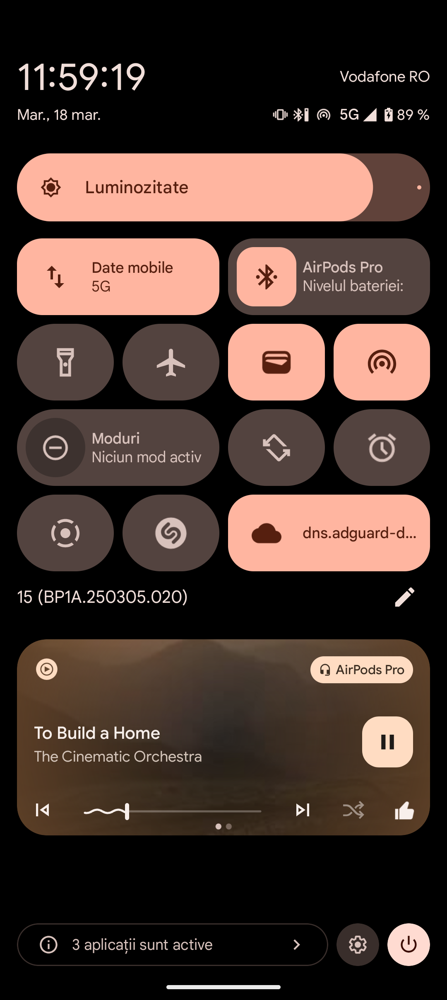
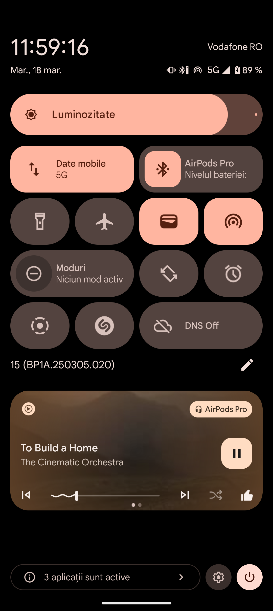

# DnsToggle

**DnsToggle** is a personal project designed specifically for **Android 15** (the current version I'm using). It provides a simple solution for toggling DNS settings, with **dns.adguard-dns.com** as the only supported server. I primarily use AdGuard DNS and, therefore, have not included other DNS servers.

The idea for this app arose from past issues I encountered with other DNS toggler apps. Even when those apps were set up as system apps, they were still frequently killed by the system. In contrast, **DnsToggle** works more reliably for me, without the delays I experienced with other solutions. This app serves as my personal fix for these issues.

## Important
Make sure to either make the app as system app or give it WRITE_SECURE_SETTINGS

```adb shell pm grant com.dnstoggle.sba android.permission.WRITE_SECURE_SETTINGS```


### Screenshots

<div style="display: flex; justify-content: space-between;">
    
    
</div>
